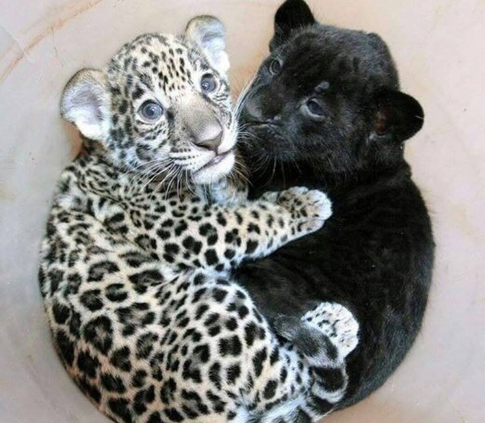

## Background

Turing patterns were introduced by Alan Turing in 1952 to describe the way patterns can arise naturally out of a uniform state. Reaction-diffusion theories of morphogenesis have served as important models in theoretical biology, as patterns such as hexagons, spirals and stripes are found as solutions of Turing-like reaction-diffusion equations. 

The parameters will depend on the physical system under consideration: for example, in fish skin pigmentation, the associated equation is a three-field reaction-diffusion where the linear parameters are associated with pigmentation cell concentration and the diffusion parameters are not the same for all fields. 

As well as in biological systems, Turing patterns occur in other natural systems, for example, the wind patterns formed in sand. 

## The Model
Here, we simulate a system that has been proposed by Alan Turing as a model of animal coat pattern formation. Two chemical substances influencing skin pigmentation interact according to a reaction-diffusion model. This system is responsible for the formation of patterns that are reminiscent of the pelage of zebras, jaguars, and giraffes.

<math xmlns="http://www.w3.org/1998/Math/MathML" display="block">
  <mtable columnalign="right left right left right left right left right left right left" rowspacing="3pt" columnspacing="0em 2em 0em 2em 0em 2em 0em 2em 0em 2em 0em" displaystyle="true">
    <mtr>
      <mtd>
        <mfrac>
          <mrow>
            <mi mathvariant="normal">&#x2202;<!-- ∂ --></mi>
            <mi>u</mi>
          </mrow>
          <mrow>
            <mi mathvariant="normal">&#x2202;<!-- ∂ --></mi>
            <mi>t</mi>
          </mrow>
        </mfrac>
      </mtd>
      <mtd>
        <mi></mi>
        <mo>=</mo>
        <mi>a</mi>
        <mi mathvariant="normal">&#x0394;<!-- Δ --></mi>
        <mi>u</mi>
        <mo>+</mo>
        <mi>u</mi>
        <mo>&#x2212;<!-- − --></mo>
        <msup>
          <mi>u</mi>
          <mn>3</mn>
        </msup>
        <mo>&#x2212;<!-- − --></mo>
        <mi>v</mi>
        <mo>+</mo>
        <mi>k</mi>
      </mtd>
    </mtr>
    </mtable>
</math>
  
and
  
<math xmlns="http://www.w3.org/1998/Math/MathML" display="block">
  <mtable columnalign="right left right left right left right left right left right left" rowspacing="3pt" columnspacing="0em 2em 0em 2em 0em 2em 0em 2em 0em 2em 0em" displaystyle="true">  
    <mtr>
      <mtd>
        <mi>&#x03C4;<!-- τ --></mi>
        <mfrac>
          <mrow>
            <mi mathvariant="normal">&#x2202;<!-- ∂ --></mi>
            <mi>v</mi>
          </mrow>
          <mrow>
            <mi mathvariant="normal">&#x2202;<!-- ∂ --></mi>
            <mi>t</mi>
          </mrow>
        </mfrac>
      </mtd>
      <mtd>
        <mi></mi>
        <mo>=</mo>
        <mi>b</mi>
        <mi mathvariant="normal">&#x0394;<!-- Δ --></mi>
        <mi>v</mi>
        <mo>+</mo>
        <mi>u</mi>
        <mo>&#x2212;<!-- − --></mo>
        <mi>v</mi>
      </mtd>
    </mtr>
  </mtable>
</math>
  
The variable u represents the concentration of a substance favoring skin pigmentation, whereas v represents another substance that reacts with the first and impedes pigmentation (inhibitor).

In this case we are interested in the case where τ is very big and k=0. This will reduce the above equations to a version of the Fisher reaction diffussion equation:

<math xmlns="http://www.w3.org/1998/Math/MathML" display="block">
  <mtable columnalign="right left right left right left right left right left right left" rowspacing="3pt" columnspacing="0em 2em 0em 2em 0em 2em 0em 2em 0em 2em 0em" displaystyle="true">
    <mtr>
      <mtd>
        <mfrac>
          <mrow>
            <mi mathvariant="normal">&#x2202;<!-- ∂ --></mi>
            <mi>u</mi>
          </mrow>
          <mrow>
            <mi mathvariant="normal">&#x2202;<!-- ∂ --></mi>
            <mi>t</mi>
          </mrow>
        </mfrac>
      </mtd>
      <mtd>
        <mi></mi>
        <mo>=</mo>
        <mi>a</mi>
        <mi mathvariant="normal">&#x0394;<!-- Δ --></mi>
        <mi>u</mi>
        <mo>+</mo>
        <mi>u</mi>
        <mo>&#x2212;<!-- − --></mo>
        <msup>
          <mi>u</mi>
          <mn>3</mn>
        </msup>
      </mtd>
    </mtr>
    </mtable>
</math>
  
In other words, the inhibitor is no longer effective and the melanin is produced in all the domain instead of specific points. This can occur due to a nonsense mutation that causes the gene responsible for the inhibition to malfuction or in extreme cases stop working all together e.g. a protein is not produced at all. Usually, a heterozygous individual with a heatly variation of the genes won't exhibit any alterations to its phenotype, although hetorozygous parants can produce offsprings with both the normal and black phenotype. This can be seen in the photo below, in which twin leopards with diffrent coat pigmentation.

## Our Aim

We are aiming to create a PDE solver used to generate Turing equation. In particular we focused on:

* Testing a numerical solution of the Fisher reaction diffusion equation using the Finite Differences (FD) method and comparing it to the analytical solution using the Neumann boundary condition.
* Ploting the error between the numerical and analytical solution.
* Comparing our case of malfuctioning inhibitor (τ big, k=0) to it's normal function and visualising it for different times.
* Implementing optimisers and MCMC methods to recover the distributions of parameters associated with data generated by a Turing reation-diffusion system.
